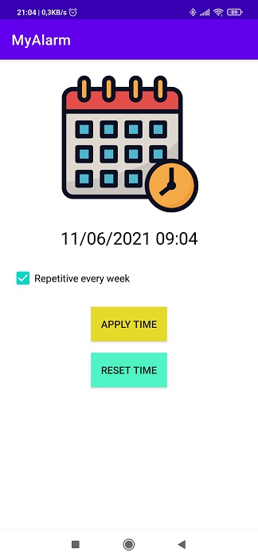

# Alarm application
Create a simple Alarm application which provides following features

## Requires
a. A simple UI contains:
    i. A time picker so that user is able to set alarm time
    ii. A checkbox for repeating option
    iii. A button to set alarm
b. When alarm goes off, the application must fire a notification with sound and
vibration for user
c. The application should be able to run in background

## Screenshot

